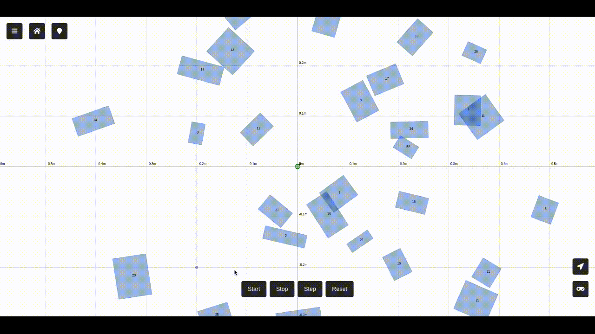

# Path Planning Visualizer


This project provides a simple and easily deployable platform to visualize the flow of path planning algorithms in dynamic environments.

## Project history and current state

Initially, our idea was to design two separate protocol stacks: the first for implementing path planning algorithms that could be run on a separate machine to control an agent in a physical or in a simulated environment; the second to abstract a mobile robot (unicycle, holonomic, non-holonomic, etc.), allowing us to define its structure and behavior in response to commands (forward, backward, turn, etc.). This combination would've allowed the use of agents with low computational power, controlled remotely by a server. The second stack was intended to be used both in simulation and for controlling real hardware, by simply providing an implementation of the interfaces to control the actual hardware. The concept is similar to ROS, where you can define a robot in simulation and then use the same code to control the real one. A simulation loop would accept data from the robot (e.g. its accurate position if in simulation or its odometry if real), compute a path to the goal and send back instructions on how to reach it. 
In our former vision a visualization part should've been completely independent from the server handling the path planning stuff. A client could be either a physical robot or a simulated one in a virtual environment, both were supposed to receive the same data and work with it, making the transition between them seamless. This would have allowed us to test algorithms in simulation and then deploy them directly on the physical robot without modification.

Unfortunately, several parts of the project has been put on hold and what is left is a (pretty good in my opinion) simulation platform that lets you visualize the logic behind path planning algorithms. Our entire focus has shifted on this and we eventually strayed from the original plan: we started developing the visualization of the underlying simulation loop with Flask in a client-server fashion but the two became too interwined. We made possible for multiple devices to connect to the server and as a result the server has to send a lot of data. For this and many other reasons we recognize that this approach is not optimal for visualization purposes only (that is the current state of the project); we might have chosen different technologies if the goal had been solely to visualize path planning algorithms from the beginning, perhaps opting for a solution entirely in JavaScript with some kind of graphical acceleration. 

In the end, it was fun but this project took way too much effort to reach a state in which it can be considered stable enough. Any contribution is welcome.

## Examples

|  |  |
|-----------------------|-----------------------------|
|  |  |
|  |  |

## Installation

    $ git clone https://github.com/ggldnl/Path-Planning-Visualizer
    $ cd Path-Planning-Visualizer
    $ conda env create -f environment.yml
    $ conda activate path_planning_visualizer

## How to run

To run the application, from the main folder, simply do the following (while the conda environment is active):

```
python application.py
```

This will launch a Flask server; open the address on the console from a web browser to reach the web page.

## Interface 

The interface is very simple so I won't bother explaining it. Many of the commands should be clear just by using it.

The main screen displays a Cartesian plane with a robot, randomly generated obstacles, and a goal. We can pan and zoom in and out of the plane.

The section contains buttons to start, stop, step through, and reset the simulation.

The top left corner features buttons to recenter the view on the robot, reset the view to initial coordinates and access the left sidebar. The left sidebar allows adjustment of the robot's speed, loading different robot models throguh URDFs (the top view of the URDF is projected on the plane, it doesn't quite work yet), saving/loading a map and generate a new one, along with other settings.

The bottom right corner includes a button to open the right sidebar and a button to quick start the agent. The right sidebar is used to select the path planning algorithm and monitor algorithm progress. Some algorithms can handle dynamic environments (obstacles change while the algorithm itself is running) and continuously update the solution they previously found to reach the goal; we could run them indefinitely but instead we set a threshold for the available number of iterations the algorithm can run. The button to quick start the agent saturates the remaining iterations when we are satisfied by the current solution, we don't want to further edit the map and we want the robot to go to the goal.

## Currently implemented algorithms

Below are the algorithms implemented so far. Some of them do not work in dynamic environments but are the base cases and thus an implementation is also provided; editing the map is disabled when they are selected; some of them let you edit the map only when the goal has been reached at least once. You can set the goal by double clicking, remove an obstacle by clicking on it and add an obstacle by clicking on an empty region on the screen. 

```
Search-based Planning
├── Best-First Searching
├── Breadth-First Searching (BFS)
├── Depth-First Searching (DFS)
├── A*
└── Dynamic A*

Sampling-based Planning
├── RRT
├── RRT *
├── Dynamic-RRT
└── Informed RRT*
```

## Algorithm stack

In order to uniform the algorithms and provide a common structure between them, we created a hierarchy. Almost all the code required to let the algorithm run is contained in the `SearchAlgorithm` base class. This interface represents all the search algorithms. Every algorithm has an initial phase in which data structures are set up, a search loop in which algorithm-specific logic is repeatedly executed to gather necessary information and a post loop phase in which the gathered information is processed in order to produce the path. Having this structure allowed us to reduce the complexity that would be required to write from scratch an algorithm, allowing the us to focus only on the aspects that differentiate one search algorithm from others.

We further specialized the base class for two classes of algorithms:
- Search based: Use the `SearchBased` subclass for grid-based algorithms (the search space is discretized into a grid). Examples include A* and Dijkstra’s algorithms.
- Sampling based: Use the `SamplingBased` subclass for sampling-based algorithms (operating in a continuous space by randomly sampling points). Examples include RRT (Rapidly-exploring Random Tree).

## Add a new search algorithm

### Define the class

Extend either `SearchBased` or `SamplingBased` depending on your algorithm's nature. Implement the required methods to define how your algorithm initializes, performs the search, and processes results.

```python
class MyGridSearchAlgorithm(SearchBased):

    def __init__(self, 
                 world_map,                 # Reference to the map
                 start=Point(0, 0),         # Starting point
                 margin=0.2,                # Minimum margin between agent and obstacles
                 iterations_per_step=1,     # Execution speed
                 max_iterations=5000,       # Maximum allowed iterations
                 discretization_step=0.2    # Size of each grid tile
                 # Additional parameters here
                 ):
        
        super().__init__(
            world_map, 
            start, 
            margin=margin, 
            iterations_per_step=iterations_per_step,
            max_iterations=max_iterations,
            dynamic=False,                  # If it can react to a dynamically changing environment
                                            #   (at each iteration the obstacles can be different)
            discretization_step=discretization_step
        )
        

    def pre_search(self):
        # Prepare for search, e.g., setup data structures
        print('Custom pre-search setup')

    def step_search(self):
        # Implement the search logic specific to your algorithm
        # (one iteration of the loop)
        print('Performing search step')

    def post_search(self):
        # Finalize the search, process the result
        print('Custom post-search processing')

```

### Implement the logic

- `pre_search()`: Initialize any data structures or settings needed before the search begins (e.g. stack, queue, ...);
- `step_search()`: Define a step of the core search logic; this step will be called until the termination condition are met (this part is handled by the `SearchAlgorithm` interface);
- `post_search()`: Perform any final processing, such as path reconstruction (e.g. some search algorithms build the path backwards once they reach the goal and it needs to be reversed);

Optionally, include any algorithm-specific parameters to the constructor.

The interfaces provide a way to automatically handle max iteration overflow.

## TODO

- [ ] Fix bug with random goal position for Dynamic A Star
- [ ] Provide multi robot support
- [ ] Fix bugs with urdf loading (robot stops moving after few steps, maybe step size)
- [ ] Find a way to specify obstacles shape (rectangle, polygons, ...)
- [ ] Find a way to choose the behavior of the map (moving/spawning obstacles)
- [ ] Fix inverted angles in link origin (URDF parser)
- [ ] Add typing and input checking 
- [ ] Update documentation
